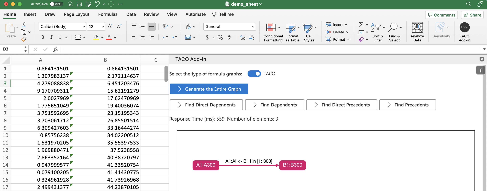

# **Overview**
TACO-Lens is an Excel plugin that is based on TACO, a framework that efficiently compresses, queries, and maintains spreadsheet formula graphs. In TACO-Lens, users can visually inspect formula graphs in a compact representation provided by TACO and efficiently trace dependents or precedents given a selected spreadsheet range.

TACO-Lens is published in VLDB'23 as a [demo paper](https://people.eecs.berkeley.edu/~totemtang/paper/TACO-Lens.pdf), TACO is published in [ICDE'23](https://people.eecs.berkeley.edu/~totemtang/paper/TACO-TR.pdf), and the TACO source code is [here](https://github.com/taco-org/taco).

# **Using TACO-Lens**

## Prerequisites

- Docker Desktop
- Microsoft Excel desktop
- Node.js LTS and npm

## Start the backend server

From the project root:

```sh
docker compose up --build
```

Notes:

- Use `docker compose`, not `docker-decompose`.
- The first build may take a few minutes because the Java image and Maven dependencies need to be downloaded.
- Leave this terminal running while you use the add-in.

## Start the Excel add-in

Open a second terminal and move to the `add-in` folder:

```sh
cd add-in
```

### Windows

Install dependencies:

```powershell
npm.cmd install
```

Start the add-in:

```powershell
npm.cmd run start
```

Windows notes:

- If `npm` is not found right after installing Node.js, fully restart your terminal or editor.
- In PowerShell, `npm` may be blocked by execution policy. In that case, use `npm.cmd` instead of `npm`.
- The first time you run the add-in, Excel's Edge WebView loopback permission may require an administrator terminal. If prompted and the command fails with an access denied error, reopen the terminal as Administrator and run `npm.cmd run start` once.

### macOS

Install dependencies:

```sh
npm install
```

Start the add-in:

```sh
npm run start
```

macOS notes:

- If `npm` is not found, restart the terminal after installing Node.js.
- You should not need the Windows-specific `npm.cmd` workaround.

## Use the add-in

1. Running `npm run start` or `npm.cmd run start` should automatically open Excel with the add-in loaded.
2. You can also open your own workbook, such as the provided `demo_sheet.xlsx`, and then open the **TACO Add-in** task pane.
3. Click **Generate the Entire Graph** to build the formula graph for the active worksheet.
4. Select a range in Excel and use the dependent or precedent buttons to inspect subgraphs.

## Troubleshooting

### Windows quick fixes

- `npm` is not recognized: restart the terminal or editor after installing Node.js.
- PowerShell blocks `npm`: use `npm.cmd` instead.
- `Allow localhost loopback` fails with access denied: run `npm.cmd run start` once in an Administrator terminal.
- The add-in opens but buttons do nothing: make sure `docker compose up --build` is still running.

### The add-in opens, but clicking graph buttons does nothing

This usually means the backend server is not running.

Check that:

- `docker compose up --build` is still running successfully.
- The backend container is up on port `4567`.
- You started the add-in from the `add-in` folder.

### Docker starts building, but the backend container exits immediately

This project uses a shell entrypoint for the backend container. If you are working on Windows, keep the repository settings that preserve LF line endings for shell scripts. Otherwise the Linux container may fail to start.


